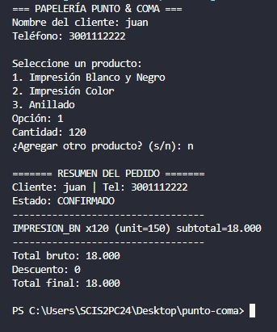
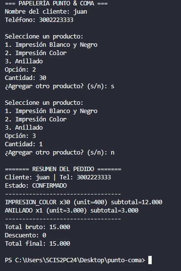
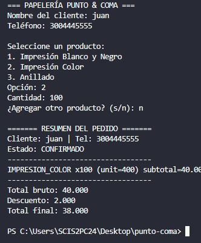
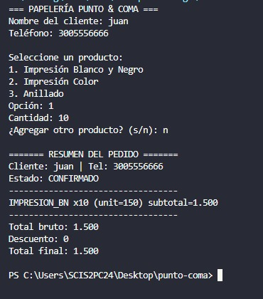
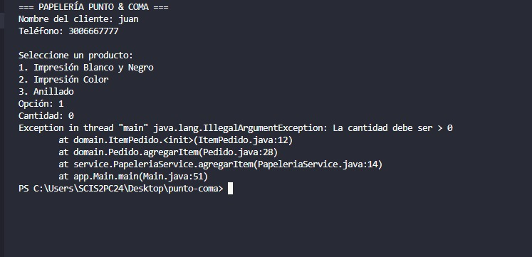
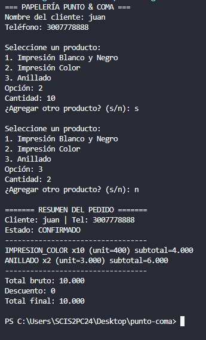
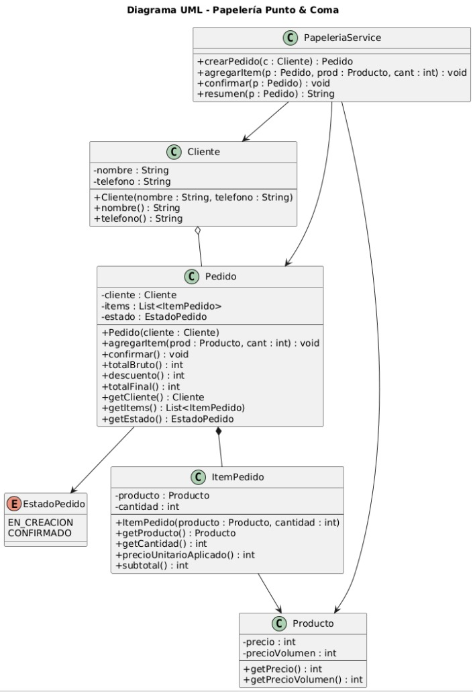

# Papelería “Punto & Coma”

En Punto & Coma, estudiantes e independientes hacen encargos de impresión y anillado para recoger el mismo día. El sistema registra nombre y teléfono del cliente y permite crear un pedido con ítems de este catálogo: Impresión B/N ($200 c/u, o $150 c/u si son 100 o más), Impresión Color ($500 c/u, o $400 c/u si son 50 o más), y Anillado ($3.000 c/u, sin precio por volumen). El cálculo funciona así: primero determinar subtotales por ítem aplicando precio por volumen cuando corresponda; luego sumar el total bruto; después aplicar un solo beneficio: si el pedido incluye al menos un anillado y la suma de impresiones (B/N + Color) es ≥ 30, se aplica 10% de descuento; de lo contrario, si el total bruto > $40.000, aplicar 5% de descuento; si ninguna condición se cumple, no hay descuento. No se aceptan cantidades ≤ 0. Tras confirmar el pedido, queda bloqueado y el sistema debe mostrar un resumen con detalle (precio aplicado por ítem), total bruto, descuento y total final. No se gestiona inventario ni pagos: solo el flujo de crear → calcular → confirmar → resumir.

Primer Paso
RF1. Registrar cliente (nombre, telefono).

RF2. Crear pedido en estado EN_CREACION.

RF3. Agregar items al pedido (producto, cantidad).

RF4. Usar precio por volumuen si la cantidad de un producto >= 30. 

RF5. Calcular total (suma de subtotales y, si el total bruto > 40k, aplicar el 5% descuento). 

RF6. Confirmacion pedido, luego de esto no se puede editar. 

RF7. Validar: cantidades > 0; totaltes no negativos.

RF8. Listar resumen: detallar (precio normal o por volumen), subtotal, descuento y total final.

Segunto paso: Reglas del negocio
Catalogo fijo: Impresión B/N ($200 c/u, o $150 c/u si son 100 o más), Impresión Color ($500 c/u, o $400 c/u si son 50 o más), y Anillado ($3.000 c/u, sin precio por volumen).

Volumen por producto.

Descuento: 5% si el total bruto > 40.000

Estados: EN_CREACION -> CONFIMADO

Tercer Paso

CA1. Volumen
Dado Impresión B/N x120, cuando calculo subtotal, uso 150 c/u.

CA2. Beneficio principal (10%)
Dado 1 anillado y 30 impresiones, aplico 10% de descuento.

CA3. Beneficio alterno (5%)
Dado total bruto 45.000 sin condición de 10%, aplico 5%.

CA4. Bloqueo después de confirmar
Dado pedido CONFIRMADO, al intentar agregar ítem, se rechaza.

CA5. Validación de cantidad
Dado cantidad 0, al agregar ítem, se rechaza.

CA6. Resumen
Dado un pedido válido, al pedir resumen se listan precios aplicados, subtotales, descuento y total final.

Cuarto Paso
1. Cliente (entidad simple).

2. Producto (puede ser enumerar con precios del dia).

3. ItemPedido (producto + cantidad, calcula su subtotal segun volumen).

4. Pedido (compone ItemPedido, conoce estado, calcula total + descuento, confirma).

5. PapeleriaService (coordina casos de uso: crear pedido, agregar item, confirma, resumen)

Quinto Paso
1. Ingresar cliente.

2. Crear pedido.

3. Seleccionar producto y cantidad.

4. Mostrar resumen: detalle con precio aplicado, subtotal por item, total bruto, descuento y total final.

5. Confirmo pedido.

6. Al intentar editar, debe fallar

js``
papeleria/
├─ app/
│  └─ Main.java
│
├─ domain/
│  ├─ Cliente.java
│  ├─ Producto.java
│  ├─ ItemPedido.java
│  ├─ Pedido.java
│  └─ EstadoPedido.java
│
└─ service/
   └─ PapeleriaService.java

``

